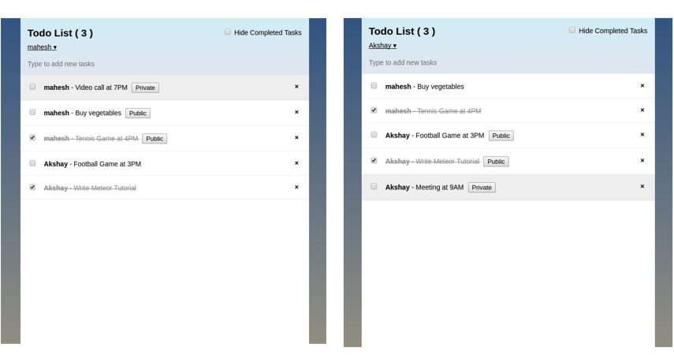

# simple-todos [](https://travis-ci.org/jainnakki/simple-todos)
Simple app to manage a task list using Meteor with Angular

Use it to share a single todo list with your friends. The list updates on everyone's screen in real time, and you can make tasks private if you don't want others to see them.

By default, app runs at http://localhost:3000

Learn how to build this app by following the [Meteor Tutorial](https://www.meteor.com/tutorials/angular/creating-an-app).

### Travis integration for tests
This can be used when deploying app on cloud for testing after every build.

#### Steps

1. Sign up on [Travis](https://travis-ci.org) with our GitHub account if not already. It will sync all our repositories on GitHub.

2. Go to our Travis profile page and enable this GitHub repository we would like to test.

3. configuration file for Travis is available in root of our GitHub repository. This file is called ‘.travis.yml’

4. Travis starts testing the repository automatically. You can see the status of the tests on your Travis profile page.

Congrats!, from now on every commit you push to your GitHub repository will be automatically tested by Travis.




### Running the app

```bash
meteor npm install
meteor
```

### Testing the app

```bash
meteor npm test
```
